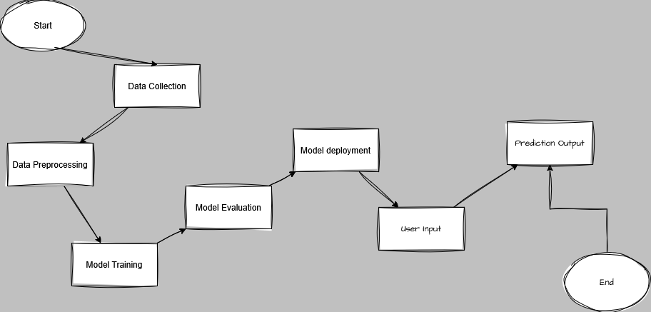

# PulseCheck - AI-Powered Heart Disease Prediction

PulseCheck is a machine learning-based predictive healthcare system designed to assess the risk of heart disease based on patient health data.PulseCheck provides fast and accurate predictions, helping in early detection and preventive care. The project is a collaborative effort, developed by:

- **[Uzair A.Jokhio](https://github.com/Uzair-A-Jokhio)** – Team Lead
- **[Hasrat Nazar](https://github.com/hasratnazar)**
- **[Jawad Umrani](https://github.com/itsjawadbaloch)**
- **[Sultan Chandio](https://github.com/MSultanChandio)**

# Steps for the Project!

